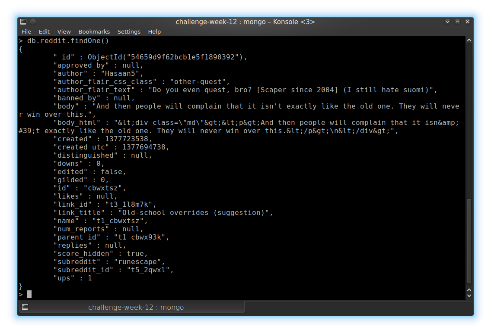

# Challenge Week 12 Submission Template

# Reddit Data Challenges

## Challenge 1



## Challenge 2

It is interesting that so much reddit data is available in a format that is searchable.
This dataset gives the possibiliby to compute statistics of various parameters, and 
to create more advanced content searches that you can do on the site.

## Challenge 3

Some insights we could get are what words are most commonly used at reddit, what subreddits
are the most posted to, and if these varies over the time of day.

## Challenge 4

The data could tell how wide vocabularies the Reddit user have, and at what time of day
the community is most active.
You can also learn what topics are the most discussed, and find out when some specific topic 
got popular in the Reddit Community.

## Challenge 5

[challenge5.py](reddit/challenge5.py)

```
> python challenge5.py
(funny,pics): 22.75%
(funny,AdviceAnimals): 20.51%
(funny,WTF): 19.21%
(WTF,pics): 19.20%
(AdviceAnimals,pics): 18.68%
(funny,AskReddit): 17.91%
(pics,AskReddit): 17.38%
(AdviceAnimals,WTF): 17.10%
(funny,gaming): 15.74%
(AdviceAnimals,AskReddit): 15.38%
(videos,pics): 14.86%
(WTF,AskReddit): 14.68%
(todayilearned,worldnews): 14.40%
(politics,worldnews): 14.14%
(gaming,pics): 14.05%
(AdviceAnimals,gaming): 13.91%
(videos,funny): 13.81%
(todayilearned,pics): 13.73%
(worldnews,news): 13.72%
(funny,todayilearned): 13.05%
(videos,WTF): 12.99%
(AskWomen,AskMen): 12.96%
(WTF,gaming): 12.74%
(videos,todayilearned): 12.73%
(AdviceAnimals,todayilearned): 12.68%
(todayilearned,WTF): 12.56%
(videos,AdviceAnimals): 12.18%
(technology,worldnews): 11.81%
(videos,worldnews): 11.45%
(gaming,AskReddit): 11.41%
```

## Challenge 6

This would change the data set significantly, since its likely that some word are less
common in posts with high votes. Also, the question in Challenge 5 would be 
"Which two of the top 50 subreddits share the most common **top** commenters",
since many commenters might not be in the data set.

The number of comments in each subreddit may also be disproportionate to the actual number 
of comments in the subreddit.

## Challenge 7

The conclusions would be that the questions answered through the data set are not about
the whole community, but rather the part of the community that has high votes.

## Challenge 8

The data might be biased in that it is collected over limited period of time, about two weeks.

## Challenge 9

We don't know for sure if all comments during the period is included in the data set.


## Challenge 10

Collect data over another period of time, run the queries on that data and compare to
our results.

# Yelp and Weather 

## Challenge 1


```
> madisonMatch = {station_name: {$regex : /MADISON/}, date: {$regex: /20100425/}}    
> db.precipitation.aggregate([{$match: madisonMatch}, {$group:{_id:"madison",total: {$sum:"$hpcp"}}}])    
{ "_id" : "madison", "total" : 62 }
```

## Challenge 2


```
> lasVegasMatch = {station_name: {$regex : /VEGAS/}, date: {$regex: /20100425/}}
> db.normals.aggregate([{$match: lasVegasMatch}, {$group:{_id:"lasVegas",total: {$avg:"$data.wind_vctspd"}}}])
{ "_id" : "lasVegas", "total" : 41.625 }
```

**Answer:** 4.1625 mph

## Challenge 3 - 5
```
> db.business.aggregate([{$match: {city: {$in:['Madison','Las Vegas','Phoenix']}}},{$group:{_id:'$city', reviews:{$sum: '$review_count'}}}])    
{ "_id" : "Las Vegas", "reviews" : 577550 }    
{ "_id" : "Madison", "reviews" : 34410 }    
{ "_id" : "Phoenix", "reviews" : 200089 }    
```

**Las Vegas:** 577550        
**Madison:**   34410     
**Phoenix:**   200089    


## Challenge 6 [BONUS]

[extra.py](extra/extra.py)
```
> python extra.py 
(of,the): 189
(it,was): 137
(in,the): 122
(and,the): 121
(on,the): 96
(this,place): 92
(for,a): 86
(for,the): 76
(i,was): 75
(and,i): 70
(to,the): 65
(the,food): 63
(is,a): 61
(at,the): 61
(i,had): 57
(it,is): 55
(i,have): 55
(with,the): 53
(was,a): 52
(to,be): 51
```


