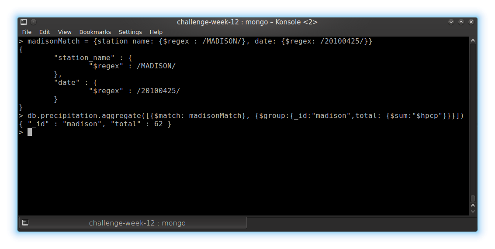

# Challenge Week 12 Submission Template

# Reddit Data Challenges

## Challenge 1

[Insert Screenshot]

## Challenge 2

[Explain what's interesting]

## Challenge 3

[Explain possible Insights]

## Challenge 4

[What it would tell you about the Reddit Community]

## Challenge 5

[Link to Code or pasted code]
[Answer]

## Challenge 6

[What does this change about our analysis?]

## Challenge 7

[How would you change your conclusions?]

## Challenge 8

[Bias in answer]

## Challenge 9

[Other Biases]

## Challenge 10

[How may you try and prove the bias]

# Yelp and Weather 

## Challenge 1



```
> madisonMatch = {station_name: {$regex : /MADISON/}, date: {$regex: /20100425/}}    
> db.precipitation.aggregate([{$match: madisonMatch}, {$group:{_id:"madison",total: {$sum:"$hpcp"}}}])    
{ "_id" : "madison", "total" : 62 }
```

## Challenge 2


```
> lasVegasMatch = {station_name: {$regex : /VEGAS/}, date: {$regex: /20100425/}}
> db.normals.aggregate([{$match: lasVegasMatch}, {$group:{_id:"lasVegas",total: {$avg:"$data.wind_vctspd"}}}])
{ "_id" : "lasVegas", "total" : 41.625 }
```

**Answer:** 4.1625 mp mphh

## Challenge 3 - 5
```
> db.business.aggregate([{$match: {city: {$in:['Madison','Las Vegas','Phoenix']}}},{$group:{_id:'$city', reviews:{$sum: '$review_count'}}}])    
{ "_id" : "Las Vegas", "reviews" : 577550 }    
{ "_id" : "Madison", "reviews" : 34410 }    
{ "_id" : "Phoenix", "reviews" : 200089 }    
```

**Las Vegas:** 577550        
**Madison:**   34410     
**Phoenix:**   200089    


## Challenge 6 [BONUS]

[Code]
[Answer]


